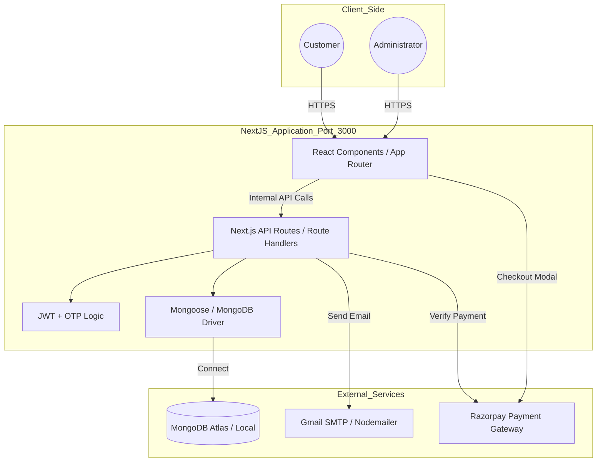

# FarmTech - Farm Solutions 

FarmTech is a complete, production-ready farming fertilizer e-commerce platform built with Next.js 14 (App Router). It features a consolidated full-stack architecture, passwordless email OTP authentication, a seamless shopping experience, and a robust admin dashboard.

---

## Setup Instructions

### Prerequisites
- Node.js: 18.x or higher
- MongoDB: Local installation or Atlas cluster
- Gmail Account: For sending OTPs (requires App Password)
- Razorpay Account: For payment integration

### 1. Clone & Install
```bash
git clone <your-repo-url>
cd frontend
npm install
```

### 2. Environment Configuration
Create a `.env.local` file in the `frontend/` directory:

```env
# MongoDB
MONGO_URI=mongodb://localhost:27017/farm-fertilizer

# JWT
JWT_SECRET=your_32_character_secret_key
JWT_EXPIRE=7d

# Email (Gmail)
EMAIL_USER=your_email@gmail.com
EMAIL_PASS=your_gmail_app_password

# Razorpay
NEXT_PUBLIC_RAZORPAY_KEY_ID=your_razorpay_key_id
RAZORPAY_KEY_SECRET=your_razorpay_key_secret
```

### 3. Database Initialization (Optional)
You can seed the database with sample products using the provided script (if available) or manually via MongoDB Compass.

### 4. Run Development Server
```bash
npm run dev
```
Visit **http://localhost:3000** 

---

##  Architecture Diagram



---

##  AI Planning Document

### Phase 1: Conceptualization & Requirements
- Objective: Solve the accessibility gap for farmers by providing a simple, secure e-commerce platform.
- Key Requirements: Mobile-first design, passwordless login (OTP), fast performance, and easy payment.

### Phase 2: Technical Design
- Stack Selection: 
    - Next.js 14 for a unified codebase (Frontend + Backend).
    - Tailwind CSS for rapid, responsive UI development.
    - MongoDB for flexible product schemas.
- Architecture: Consolidated "Single Server" approach to eliminate CORS issues and simplify deployment.

### Phase 3: Implementation Strategy
- Sprint 1: Core Auth & Database Schema (User, Product).
- Sprint 2: Product Catalog & Search/Filter functionality.
- Sprint 3: Shopping Cart & Razorpay Integration.
- Sprint 4: Admin Dashboard & Order Management.
- Sprint 5: Design Overhaul (Migrating from generic "green" to professional "Farm-Blue").

### Phase 4: Quality Assurance
- Verification of payment webhooks/signatures.
- Testing OTP delivery and expiration logic.
- Performance profiling and SEO optimization.

---

##  Assumptions Made

1. User Experience: We assume farmers prefer passwordless login (OTP) over remembering complex passwords.
2. Connectivity: The application is optimized for low-bandwidth scenarios by using Next.js Server Components to minimize client-side JavaScript.
3. Payments: We assume Razorpay is the primary gateway, catering specifically to the Indian agricultural market.
4. Data Security: All sensitive operations (payment verification, order status updates) are handled server-side to prevent tampering.
5. Deployment: The system is designed to be easily deployable on **Vercel** with a MongoDB Atlas backend.

---

## Detailed Documentation
- [Detailed Setup Guide](./frontend/SETUP_GUIDE.md)
- [Project Analysis & Fixed Issues](./frontend/PROJECT_ANALYSIS.md)
- [Security Recommendations](./frontend/SECURITY_RECOMMENDATIONS.md)
- [Performance Optimizations](./frontend/PERFORMANCE_OPTIMIZATIONS.md)

---
